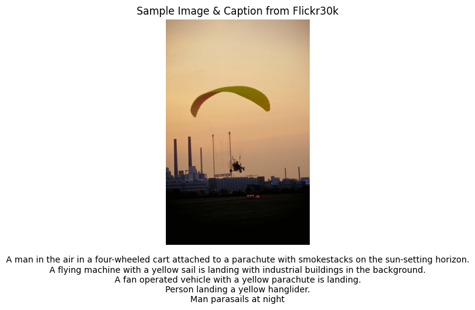

# Building a CLIP Inspired Multi-Modal Model
Building a Contrastive Language-Image Pre-training (CLIP) multi-modal model.

# Exploratory Data Analysis

# Model Design

The CLIP based multi-modal model has the following components:
1.	Image Encoder
2.	Text Encoder
3.	CLIP Model for Shared Embedding Space

The figure image below shows how the captions go through the text encoder, and the images go through the image encoder. They both have a shared embedding space such that the image embedding of a dog corresponds to the text embedding of words like ‘dog’ or ‘animal’.

